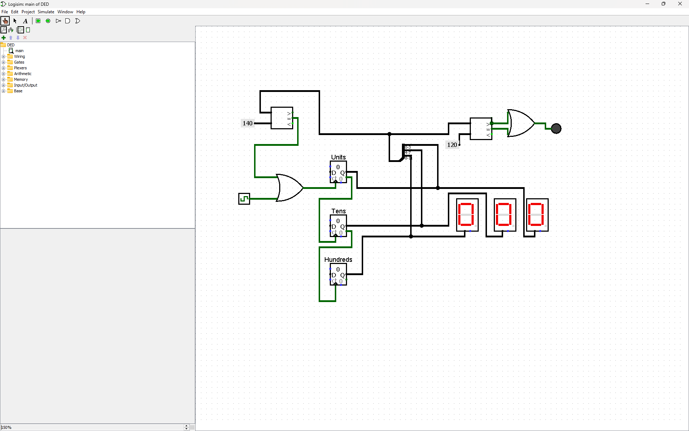

# 🚗 Car Speed Monitoring System

> A digital speed monitoring system designed and simulated in **Logisim** using counters, comparators, logic gates and digital displays.

  

---

## 💡 What is this?

This project simulates a simple **car speed monitoring system** where clock pulses represent the vehicle-speed input.

The system:

- Counts incoming pulses
- Displays the measured value
- Compares the counter output against predefined thresholds
- Detects over-speed conditions
- Stops further counting when a violation is detected

Built as part of the **Digital Electronics Design (25ECSF101)** course activity, 2025–26.
