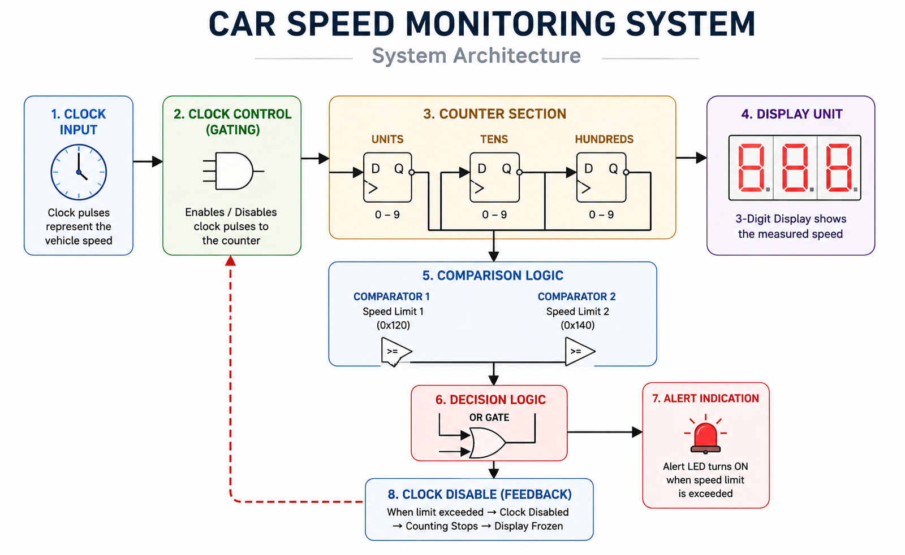
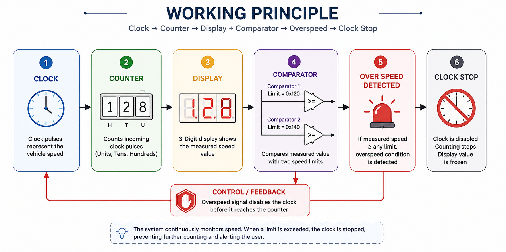

# 🚗 Car Speed Monitoring System

> A digital speed monitoring system designed and simulated in **Logisim** using counters, comparators, logic gates and digital displays.

  

---

## 💡 What is this?

This project simulates a simple **car speed monitoring system** where clock pulses represent the vehicle-speed input.

The system:

- Counts incoming pulses
- Displays the measured value
- Compares the counter output against predefined thresholds
- Detects over-speed conditions
- Stops further counting when a violation is detected

Built as part of the **Digital Electronics Design (25ECSF101)** course activity, 2025–26.

---

## ⚙️ How It Works

  

### The basic idea

**Clock → Count → Compare → Detect → Stop**

Clock pulses are used as the simulated speed input. The counter tracks these pulses while the display shows the current value.

The counter output is continuously checked against predefined thresholds. When a limit violation is detected, the control logic disables further clock pulses, stopping the count and activating the alert indication.

---

## 🔧 Built With

| Component | Role |
|---|---|
| **Logisim** | Digital circuit simulation |
| **Counters** | Count incoming clock pulses |
| **Comparators** | Check predefined speed thresholds |
| **OR Logic** | Combine limit-detection signals |
| **Digital Displays** | Show the measured value |
| **LED Indicator** | Signal an over-speed condition |

---

## 🧠 Core Concepts

`Sequential Logic` · `Counters` · `Digital Comparators` · `Combinational Logic` · `Clock Control` · `Digital Displays`

---

## 🖥️ Simulation

The complete system was designed and simulated using **Logisim**.

The simulation demonstrates:

- Multi-stage digital counting
- Three-digit display output
- Speed-limit comparison
- Over-speed detection
- Clock-control logic

> **Note:** The clock is used as a simulated speed input. The project does not use a physical vehicle-speed sensor.

---

## 🎥 Demo

See the system running in Logisim:

  <a href="Demo/Car Speed Monitering System.mp4">
    <strong>▶️ Watch the Simulation Demo</strong>
  </a>

---

## 🔄 Working Principle

  

**Clock → Counter → Display + Comparator → Overspeed → Clock Stop**

The system counts incoming clock pulses and displays the current count. The counter output is simultaneously compared against predefined speed limits.

When an overspeed condition is detected, the logic activates the alert and disables the clock input, stopping the counter at the detected value.
